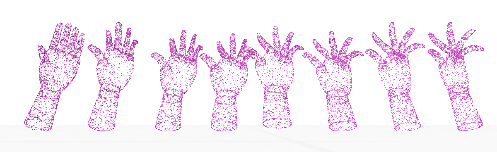

# 3D Image registrations that match through diffeomorphisms (LLDDM Resnet Paper Implementation)
An example (using 800 polyhedra each timestep over the paper's update procedure parameters and 10000 epochs). Here the first hand is the source shape, and the last one is the target. The net constructed the intermediary phases.

This is a more generalisable version of the prior order-specific 2d implementation of https://arxiv.org/abs/2102.07951 found here: https://github.com/baubels/diffeomorphic_registration. That other repo has further explanations on the paper and network.

The main differences are in the implementation of meshing and in non-order specific data streams. Previously, by limitations on the L2 norm, source and target shapes had to have had specified starting and ending coordinates already specified. This is hugely unfeasibly due to the complexity of realistic 3d point clouds - and having that knowledge would greatly simplify what needs to be actually (diffeomorphically, or other) achieved. Therefore, using a symmetric function like Chamfer's distance solves the issue of manual labelling and vastly generalises diffeomorphic image registrations. This was implicitely known in the paper (https://arxiv.org/abs/2102.07951).

### Seeing the diffeomorphic limitations

In one of my tests it was quite nice to see the limitations of using diffeomorphisms to register images. The below tells me that it takes less kinetic energy for a person to reposition their legs this way than in the normal! A possible fix to this issue would be to give non-uniform weighing to registered sources and corresponding targets, therefore focusing flows to those humanly possible as opposed to just being topologically low in loss. This however goes back to the original problem of introducing order to the source and target nodes, which with this assumption in place, makes the problem far simpler.

### Libraries Used
- Tensorflow: for making and training of the net
- Numpy: for some basic calculations
- PyMeshLab: for reading in the schred19 dataset
- Open3d: for normal vector and surface mesh creation
- polyscope: for immensely gorgeous interactive visualisations

### Citations
SCHREC19 Dataset - for images shown
https://arxiv.org/abs/2102.07951 - for paper implementation idea
